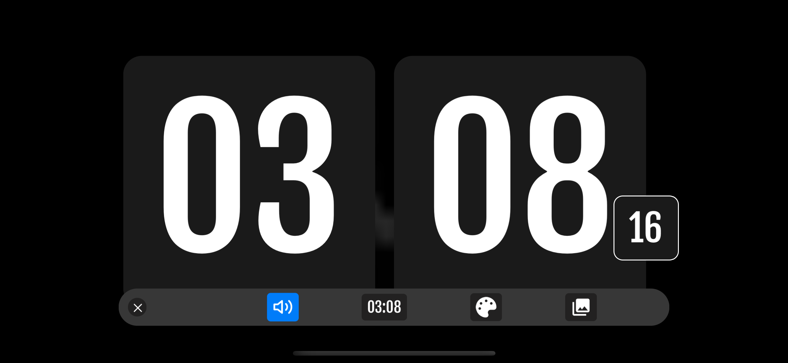
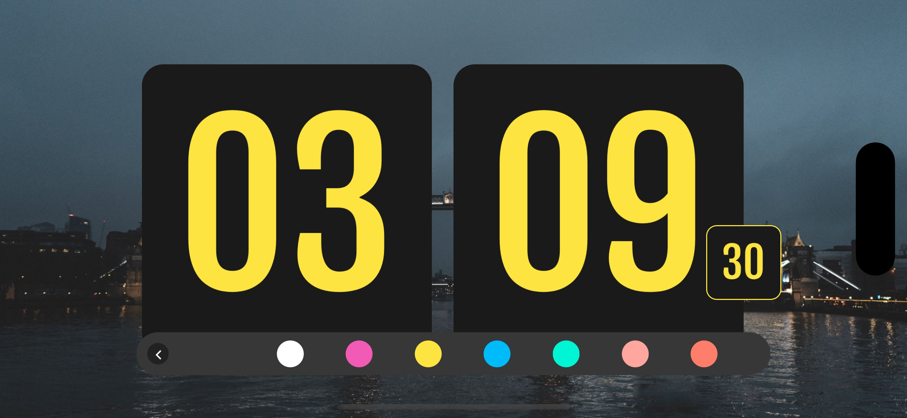

## 👩‍💻 project

- App that allows you to see the current time, through a super friendly interface, as well as some functions that allow you to customize the app.

## 🖥 Technologies & Languages

1. React
2. React Native
3. Expo Av
4. Context

## 🛠 Installing

```
> yarn 
> yarn start
```

## 🖥  View




### Happy Coding! 🚀